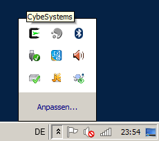
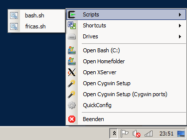
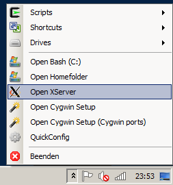
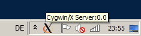
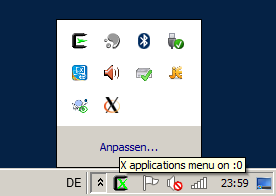
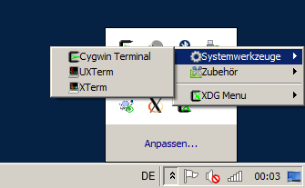
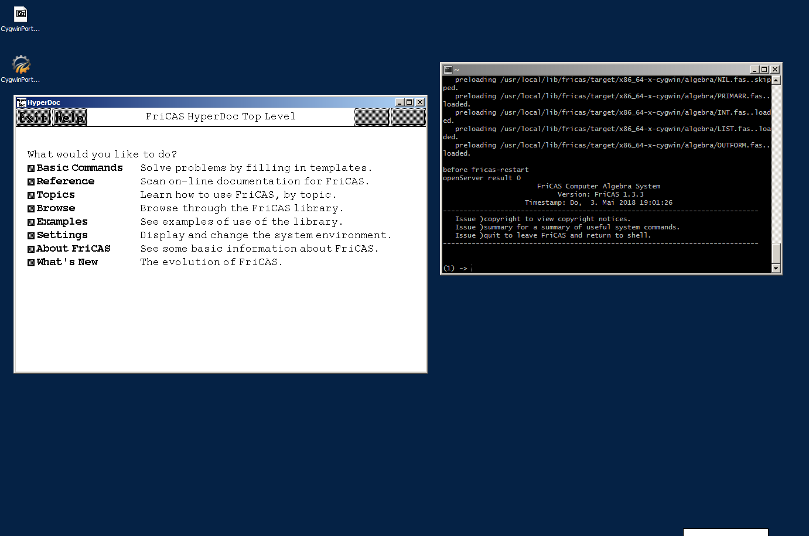
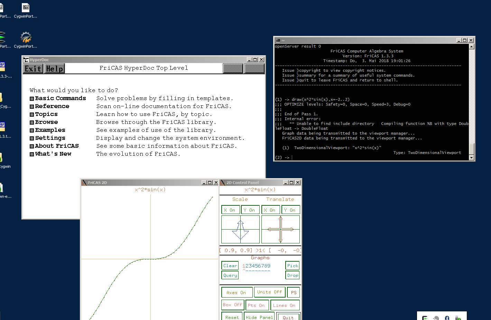
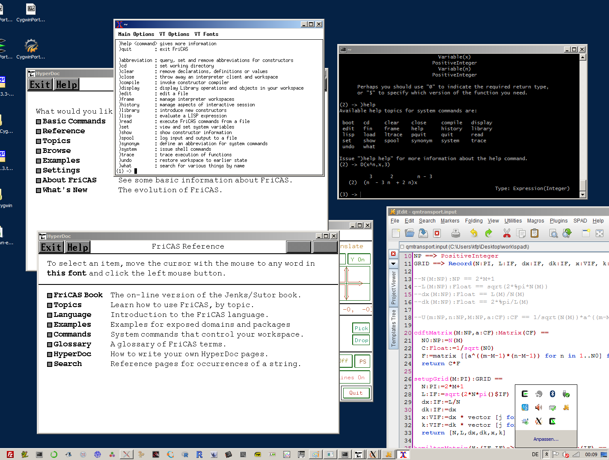

# FriCAS for Cygwin64

[FriCAS](http://fricas.sourceforge.net/)  is a general purpose computer algebra system with a strong focus on mathematical research and development of new algorithms.  (details see [Wikipedia](https://en.wikipedia.org/wiki/FriCAS)). This project is about providing a fully functional version for [Cygwin64](https://cygwin.com/) (portable) including [Cygwin/X](https://x.cygwin.com/).  
Windows 10+ users may want to use [WSL](https://docs.microsoft.com/en-us/windows/wsl/about) instead of cygwin, however, a portable FriCAS for Windows might be of interest anyway.

## Portable Cygwin Version
Most comfortable is the *portable Cygwin* version from [MachinaCore](https://github.com/MachinaCore/CygwinPortable). However, we recommend the prebuilt versions from [AppVeyor](https://ci.appveyor.com/project/MachinaCore/cygwinportable/build/artifacts)    instead of the older 1.2 releases.

## Binary Releases (fricas)
We provide binary releases for the current FriCAS version 1.3.3:

* fricas-1.3.3-x86_64-cygwin.tar.gz (install to /usr/local)
* ecl-16.1.3.tar.gz (required if you don't have ECL already)

and
* FriCAS_CygwinPortable_1.3.3.7z

**FriCAS_CygwinPortable** will run out of the box. See below how it goes.

## Portable mode howto

1. Download FriCAS_CygwinPortable64_x.y.z.7z 
2. Unpack anywhere  (7z required)
3. Start `CygwinPortable.exe`

#### 4. Use tray menu

#### 5. X server

#### 6. Cygwin terminal (mintty)

### 7. FriCAS (Hypedoc/Draw)

